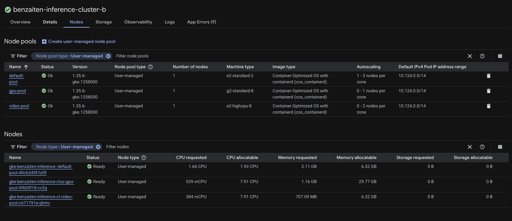

<h1 align="center">Benzaiten</h1>

    Benzaiten is a cloud-native ML pipeline orchestrator, complete with a video editor web app, that turns raw mp4 videos into high-quality karaoke multilingual KTV videos. It is powered by state-of-the-art transformer and HuggingFace models, all deployed and orchestrated for production on GCP, Docker, and Kubernetes on GKE.

 

## Benzaiten Web App Demo

## Project Elements

### HuggingFace Karaoke Transformer Models

[HuggingFace - Models](https://huggingface.co/kseto06/benzaiten/tree/main)
- Contains model configurations for BSRoformer and MelBand-Roformer transformer models, which is used for vocal/instrumental and decrowd source separation.

### GKE Cluster Infrastructure

### Cloudflare Dashboard

[Benzaiten Cloudflare Worker & Domain](https://dash.cloudflare.com/be379dcb718b673844fc9452d487c9cf/workers/services/view/benzaiten/production)
- Cloudflare worker for exposing a public worker domain for deployment and exposure of backend API of the web app in-production.
